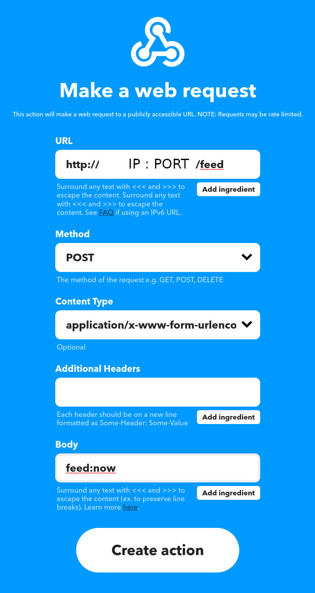

# Aquarium Fish Feeder

## Step 1 : Print alls parts

## Step 2 : Assemble all parts

## Step 3 : Install raspbian on your Raspberry Pi
1. Download [Raspbian OS](https://howtoraspberrypi.com/downloads/)    
1. Flash a SD card with the zip file by using [balenaEtcher](https://www.balena.io/etcher/) (for exemple)    
1. Plug the SD card into the Raspberry Pi and turn on the power.       
1. Follow the instructions on the screen to install the Raspbian OS.    

## Step 4 : Import the repo on your Raspberry Pi
```bash
git clone https://github.com/SylvJalb/Aquarium-Fish-Feeder.git
cd Aquarium-Fish-Feeder
```

## Step 5 : Installations
```bash
pip install -r requirements.txt
nano env.py
```
then define your environment variables in env.py:
```python
timezone_name = "Europe/Paris" # Your timezone
pwm_gpio = 12 #Use pin 12 for PWM signal
frequence = 50
```

## Step 6 : Network configurations
Go on your internet router panel and configure your DHCP to define static IP to your Raspberry Pi.     
Open the port number in your router panel and configure it to your Raspberry Pi. (tcp protocol)

## Step 7 : Start the service
```bash
./run.sh
```
----------
If you want to automatically start the service at boot, you modify your /etc/rc.local file:
```bash
sudo nano /etc/rc.local
```
and add the following line (before the `exit 0` line):
```bash
/home/pi/Aquarium-Fish-Feeder/run.sh &
```
----------


## Step 8 : IFTTT configuration
Go on your IFTTT account and create a new webhook.
Add a Applet : **IF** you condition... **THEN** use webhook like this:



# Log visualization
Now you can see the logs (dates when the feeder have been feeded) on this link:     
http://YOUR_IP_ADDRESS:PORT/feed